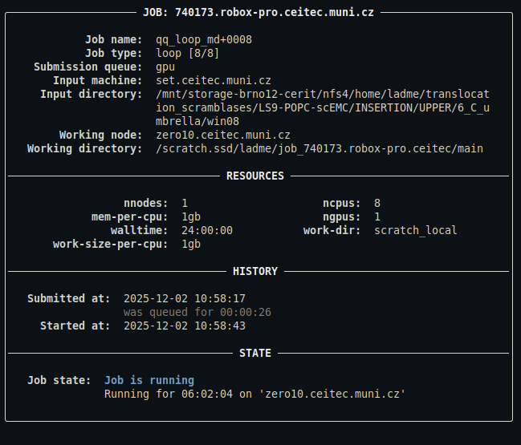
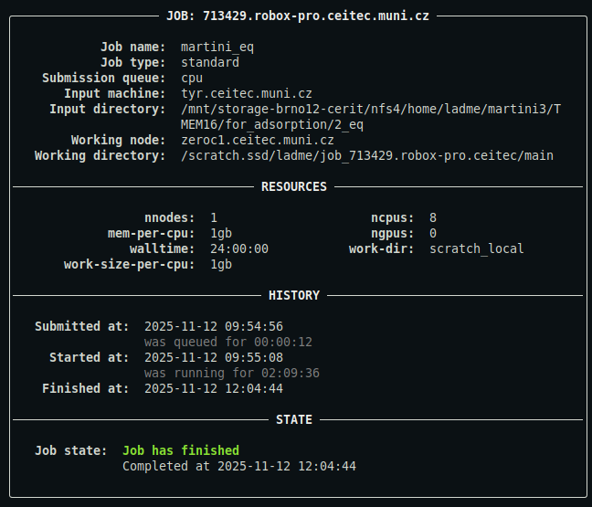
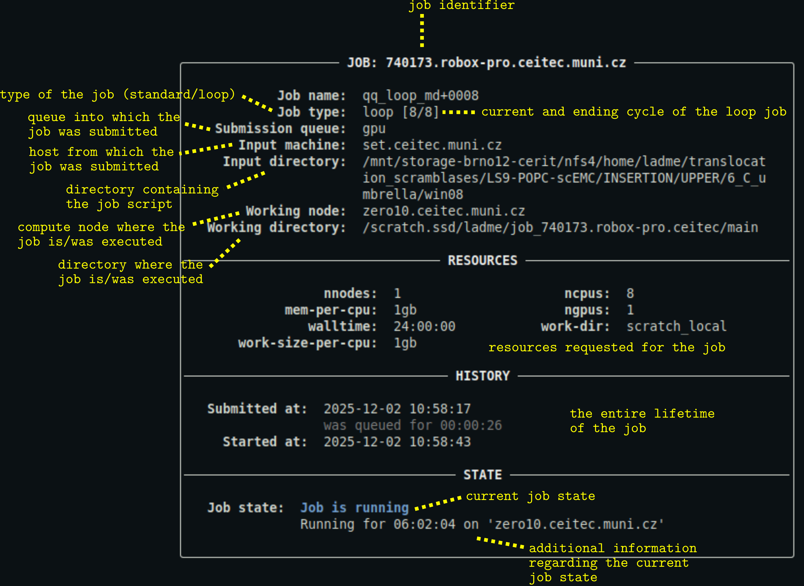

# qq info

The `qq info` command is used to monitor a qq job's state and display information about it. It is qq's equivalent of Infinity's `pinfo`.

***

> **Quick comparison with pinfo**
> - You can use `qq info` with a job ID to obtain information about a qq job without having to navigate to its input directory. You can even provide IDs of multiple jobs.
> - You can provide `qq info` with one or more directories to search for qq jobs in. Information are then displayed for all collected qq jobs.
> - Unlike `pinfo`, `qq info` focuses only on the most important details about a job.  
>   The output is intentionally compact and easier to read.

***

### Description

Displays information about the state and properties of the specified qq jobs or of qq jobs found in the specified directories.

```bash
qq info [OPTIONS] JOB_ID...
```

**JOB_ID...** — One or more IDs of jobs to display information for. Optional.

If no `JOB_ID` and no directory are provided, `qq info` searches for qq jobs in the current directory. If multiple jobs are provided or found, `qq info` prints information for each job in turn.

#### Options

- `-d`, `--dir` — One or more directories to search for qq jobs in. Supports globs.
 
- `-a`, `--all` — Print info for all your unfinished jobs.
 
- `-s`, `--server` — Collect jobs from the specified batch server. If not specified, the current server is used. Only used with `--all`.

- `-b`, `--brief`, `--short` — Display a brief summary of the job.

### Examples

```bash
qq info 740173
```

Displays the full information panel for the job with ID `740173` located on the default batch server. If the job is located on a [different batch server](../servers.md#qq-info-qq-go-qq-kill-qq-sync-qq-wipe-qq-respawn), you need to use the full ID including the server address.

This command only works if the job is a qq job with a valid and accessible info file, and the target batch server is reachable from the current machine.

This is what the output might look like:



*For a detailed description of the output, see [below](#description-of-the-output).*

***

```bash
qq info 740173 741234 741236
```

Displays full information panels for jobs `740173`, `741234`, and `741236`.

***

```bash
qq info
```

Displays full information panel for all jobs whose info files are present in the current directory.

This is what the output might look like:



*For a detailed description of the output, see [below](#description-of-the-output).*

***

```bash
qq info -b
```

Displays brief information for all jobs whose info files are present in the current directory.

***

```bash
qq info -d /path/to/dir
```

Displays full information panels for all jobs whose info files are present in directory `/path/to/dir`.

***

```bash
qq info -d /path/to/job* -b
```

Displays brief information for all jobs located in directories matching the glob pattern `/path/to/job*` (e.g., `/path/to/job1`, `/path/to/job2`, `/path/to/job3`). Useful for monitoring job collections.

***

```bash
qq info --all
```

Displays full information panels for all your uncompleted (i.e, running and queued) qq jobs.

***

```bash
qq info --all --server meta
```

Displays full information panels for all your uncompleted qq jobs associated with the Metacentrum batch server.

### Description of the output



- You can customize the appearance of the output using a [configuration file](../config.md).
