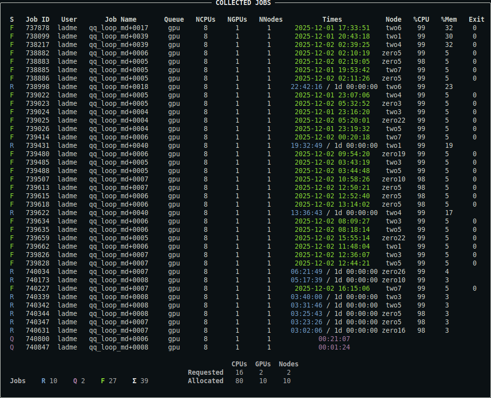

# qq jobs

The `qq jobs` command is used to display information about a user's jobs. It is qq's equivalent of Infinity's `pjobs`.

***

> **Quick comparison with pjobs**  
> - Unlike `pjobs`, `qq jobs` always shows the nodes that the job is running on, if any are assigned.  
> - Unlike `pjobs`, `qq jobs` distinguishes between failed/killed and successfully finished jobs in its output.

***

### Description

Displays a summary of your jobs or the jobs of a specified user. By default, only unfinished jobs are shown.

```bash
qq jobs [OPTIONS]
```

#### Options

`-u`, `--user` `TEXT` — Username whose jobs should be displayed. Defaults to your own username.

`-e`, `--extra` — Include extra information about the jobs.

`-a`, `--all` — Include both uncompleted and completed jobs in the summary.

`-s` `TEXT`, `--server` `TEXT` — Show jobs for a specific batch server. If not specified, jobs on the default batch server are shown.

`--yaml` — Output job metadata in YAML format.

### Examples

```bash
qq jobs
```

Displays a summary of your uncompleted jobs (queued, running, or exiting). This includes both qq jobs and any other jobs associated with the default batch server. For array jobs, individual tasks that have finished are still shown unless the array job as a whole has completed.

This is what the output might look like:


*For a detailed description of the output, see [below](#description-of-the-output).*

```bash
qq jobs -u user2
```

Displays a summary of user2's uncompleted jobs.

```bash
qq jobs -e
```

Includes extra information about your jobs in the output: the input machine (if available), the input directory, and the job comment (if available).

```bash
qq jobs --all
```

Displays a summary of all your jobs associated with the default batch server, both uncompleted and completed. Note that the batch system eventually removes records of completed jobs, so they may disappear from the output over time. This is what the output might look like:



*For a detailed description of the output, see [below](#description-of-the-output).*

```bash
qq jobs --server sokar
```

Displays a summary of all your uncompleted jobs associated with the `sokar` batch server that are available to you. `sokar` is a known shortcut for the full batch server name `sokar-pbs.ncbr.muni.cz`. You can use either of them. For more information about accessing information from other clusters, read [this section of the manual](../servers.md#qq-jobs-qq-stat-qq-queues-qq-nodes).

```bash
qq jobs --yaml
```

Prints a summary of your uncompleted jobs in YAML format. This output contains all available metadata as provided by the batch system.

### Notes

- This command lists all types of jobs, including those submitted using `qq submit` and jobs created through other tools.  
- The run times and job states may not exactly match the output of `qq info`, since `qq jobs` relies solely on batch system data and does not use qq info files.

### Description of the output


- The output of [`qq stat`](qq_stat.md) is the same, except that it displays the jobs of all users.
- You can control which columns are displayed and customize the appearance of the output using a [configuration file](../config.md).
- Note that the `%CPU` and `%Mem` columns are not available on systems using Slurm (Karolina, LUMI).