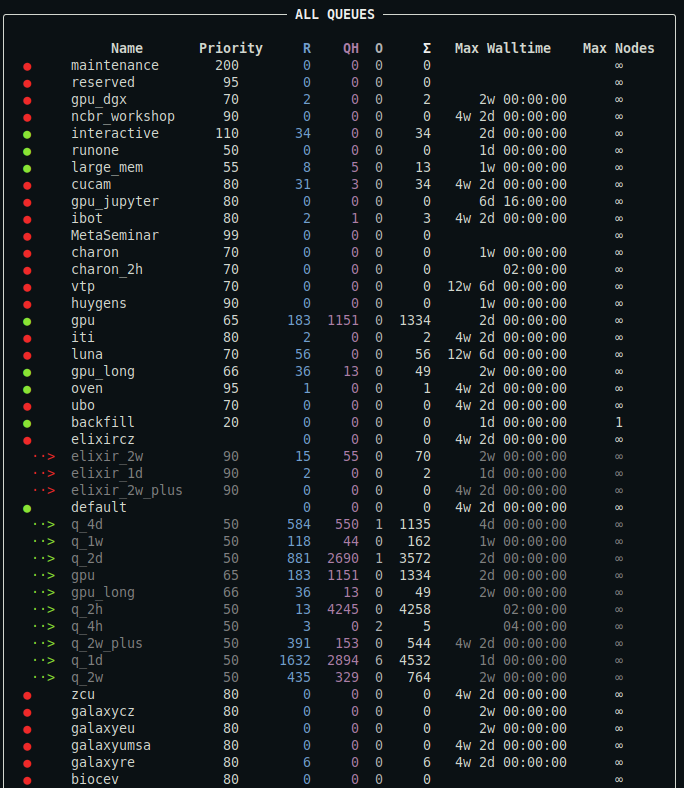
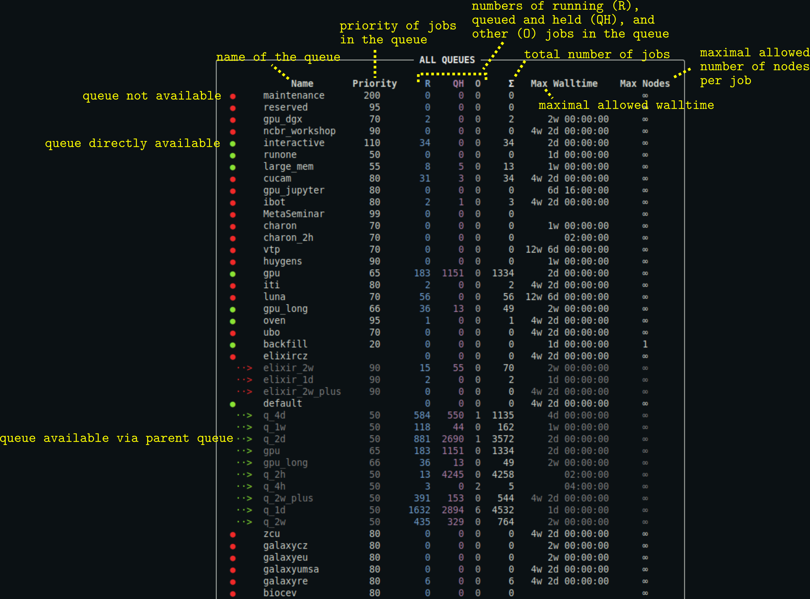

# qq queues

The `qq queues` command displays the queues available on the current batch server. It is qq's equivalent of Infinity's `pqueues`.

***

> **Quick comparison with pqueues**
> - `qq queues` is generally more accurate at identifying available and unavailable queues than `pqueues`.
> - The only other notable difference is the output format.

***

### Description

Displays information about the queues available on the current batch server. By default, only queues that are available to you are shown.

```bash
qq queues [OPTIONS]
```

#### Options

`-a`, `--all` — Display all queues, including those that are not available to you.

`-s` `TEXT`, `--server` `TEXT` — Show queues for a specific batch server. If not specified, queues for the default batch server are shown.

`--yaml` — Output queue metadata in YAML format.

### Examples

```bash
qq queues
```

Displays a summary of all queues associated with the default batch server to which you can submit jobs.

This is what the output might look like:


*For a detailed description of the output, see [below](#description-of-the-output).*

```bash
qq queues --all
```

Displays a summary of all queues associated with the default batch server, including those you cannot submit jobs to.

This is what the output might look like:



*Output truncated. For a detailed description of the output, see [below](#description-of-the-output).*


```bash
qq queues --server metacentrum
```

Displays a summary of all queues associated with the `metacentrum` batch server that are available to you. `metacentrum` is a known shortcut for the full batch server name `pbs-m1.metacentrum.cz`. You can use either of them. For more information about accessing information from other clusters, read [this section of the manual](../servers.md#qq-jobs-qq-stat-qq-queues-qq-nodes).


```bash
qq queues --yaml
```

Prints a summary of all available queues in YAML format. This output contains the full metadata provided by the batch system.

### Description of the output



- You can customize the appearance of the output using a [configuration file](../config.md).
- The output may also contain the column `Comment` providing the comment associated with the queue (typically additional information about the queue).
- `Max Nodes` column is hidden if no queue defines a maximal allowed number of requested nodes per job.