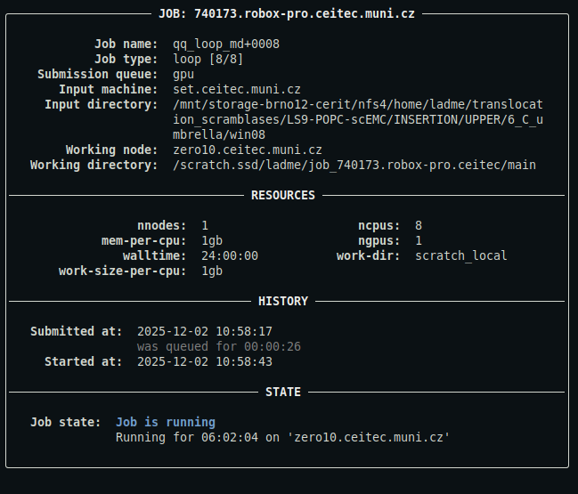
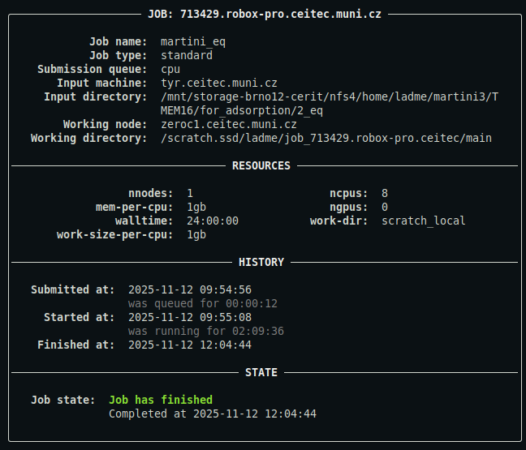
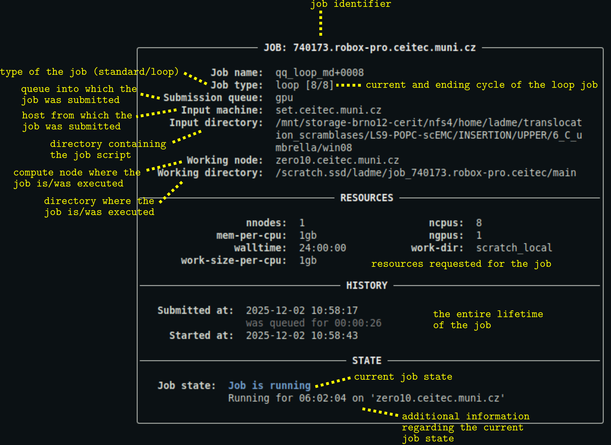

# qq info

The `qq info` command is used to monitor a qq job's state and display information about it. It is qq's equivalent of Infinity's `pinfo`.

***

> **Quick comparison with pinfo**
> - You can use `qq info` with a job ID to obtain information about a qq job without having to navigate to its input directory.
> - Unlike `pinfo`, `qq info` focuses only on the most important details about a job.  
>   The output is intentionally compact and easier to read.

***

### Description

Displays information about the state and properties of the specified qq job, or of qq jobs found in the current directory.

```bash
qq info [OPTIONS] JOB_ID
```

**JOB_ID** — Identifier of the job to display information for. This argument is optional.

If `JOB_ID` is not provided, `qq info` searches for qq jobs in the current directory. If multiple jobs are found, `qq info` prints information for each job in turn.

#### Options

`-s`, `--short` — Display only the job ID and the current state of the job.

### Examples

```bash
qq info 740173
```

Displays the full information panel for the job with ID `740173`. You can use either the short ID or the full ID including the batch server address. This only works if the job is a qq job with a valid and accessible info file, and the associated batch server is reachable from the current machine.

This is what the output might look like:



*For a detailed description of the output, see [below](#description-of-the-output).*

```bash
qq info
```

Displays the full information panel for all jobs whose info files are present in the current directory.

This is what the output might look like:



*For a detailed description of the output, see [below](#description-of-the-output).*

```bash
qq info -s
```

Displays short information for all jobs whose info files are present in the current directory. Only the jobs' full IDs and their current states are shown.

### Description of the output



- You can customize the appearance of the output using a [configuration file](config.md).