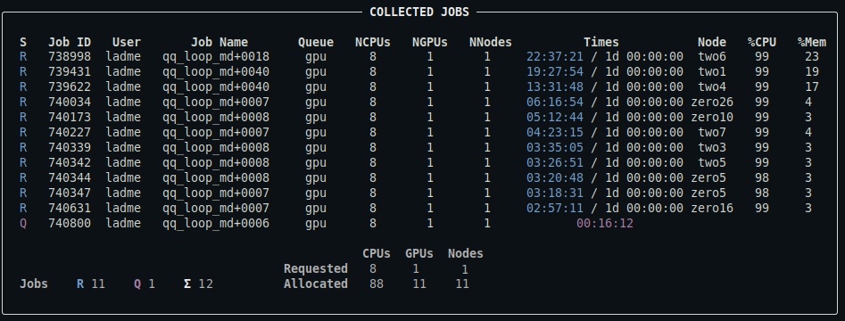
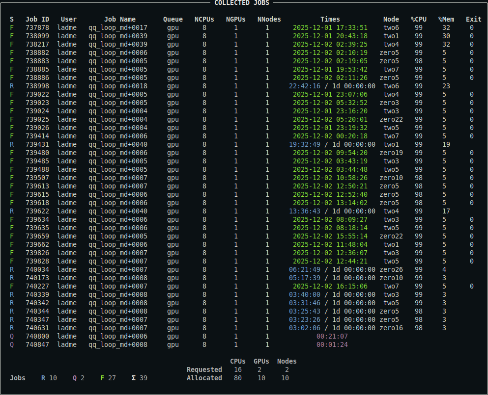
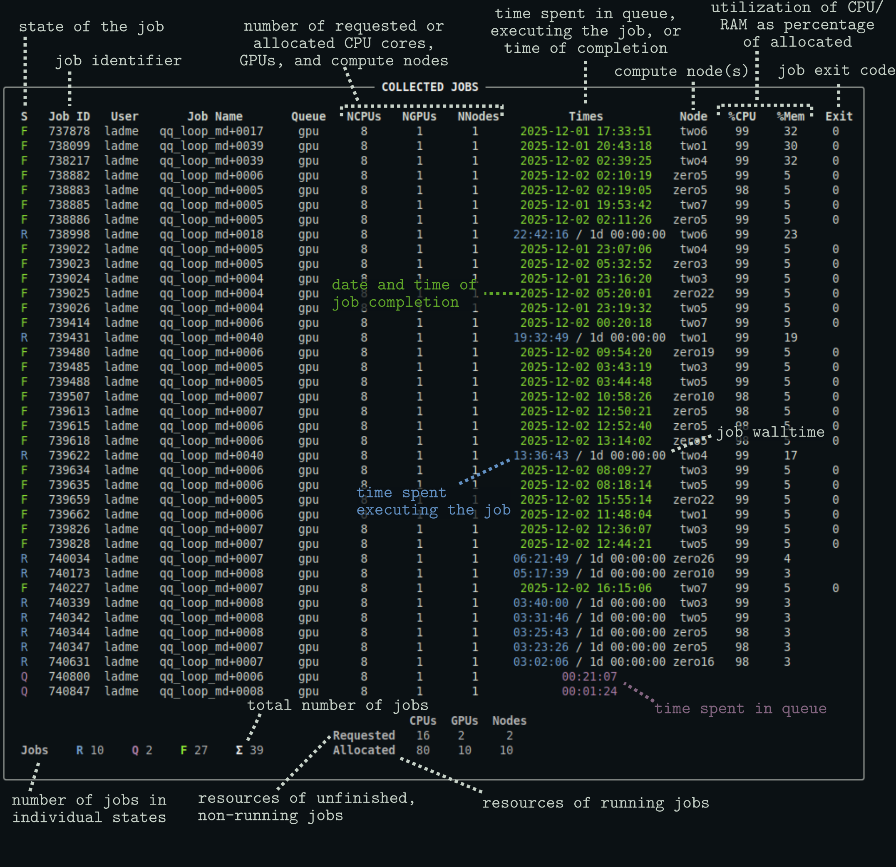

# qq jobs

The `qq jobs` command is used to display information about a user's jobs. It is qq's equivalent of Infinity's `pjobs`.

***

> **Quick comparison with pjobs**  
> - Unlike `pjobs`, `qq jobs` always shows the nodes that the job is running on, if any are assigned.  
> - Unlike `pjobs`, `qq jobs` distinguishes between failed/killed and successfully finished jobs in its output.

***

### Description

Displays a summary of your jobs or the jobs of a specified user. By default, only unfinished jobs are shown.

```bash
qq jobs [OPTIONS]
```

#### Options

`-u`, `--user` `TEXT` — Username whose jobs should be displayed. Defaults to your own username.

`-e`, `--extra` — Include extra information about the jobs.

`-a`, `--all` — Include both unfinished and finished jobs in the summary.

`--yaml` — Output job metadata in YAML format.

### Examples

```bash
qq jobs
```

Displays a summary of your unfinished jobs (queued, running, or exiting). This includes both qq jobs and any other jobs associated with the current batch server. This is what the output might look like:



*For a detailed description of the output, see below.*

```bash
qq jobs -u user2
```

Displays a summary of user2's unfinished jobs.

```bash
qq jobs -e
```

Includes extra information about your jobs in the output: the input machine (if available), the input directory, and the job comment (if available).

```bash
qq jobs --all
```

Displays a summary of all your jobs in the batch system, both unfinished and finished. Note that the batch system eventually removes records of finished jobs, so they may disappear from the output over time. This is what the output might look like:



*For a detailed description of the output, see below.*

```bash
qq jobs --yaml
```

Prints a summary of your unfinished jobs in YAML format. This output contains all available metadata as provided by the batch system.

### Notes

- This command lists all types of jobs, including those submitted using `qq submit` and jobs created through other tools.  
- The run times and job states may not exactly match the output of `qq info`, since `qq jobs` relies solely on batch system data and does not use qq info files.

### Description of the output



- The output of [`qq stat`](qq_stat.md) is the same, except that it displays the jobs of all users.
- You can control which columns are displayed and customize the appearance of the output using a [configuration file](config.md).
- Note that the `%CPU` and `%Mem` columns are not available on systems using Slurm (Karolina, LUMI).